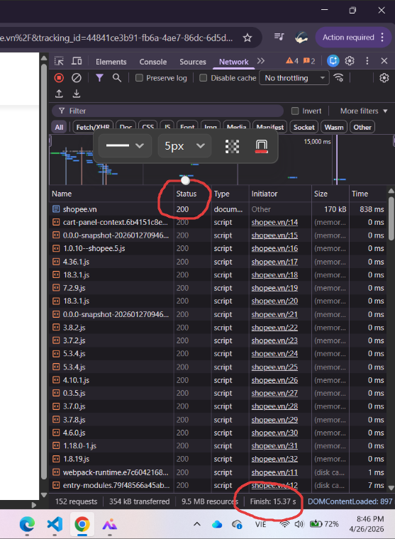
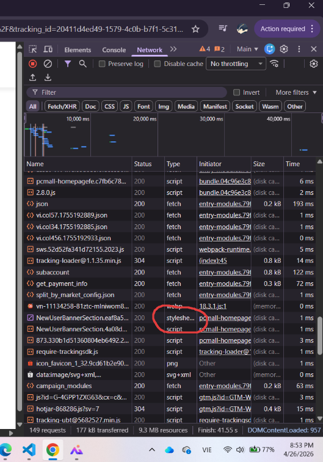
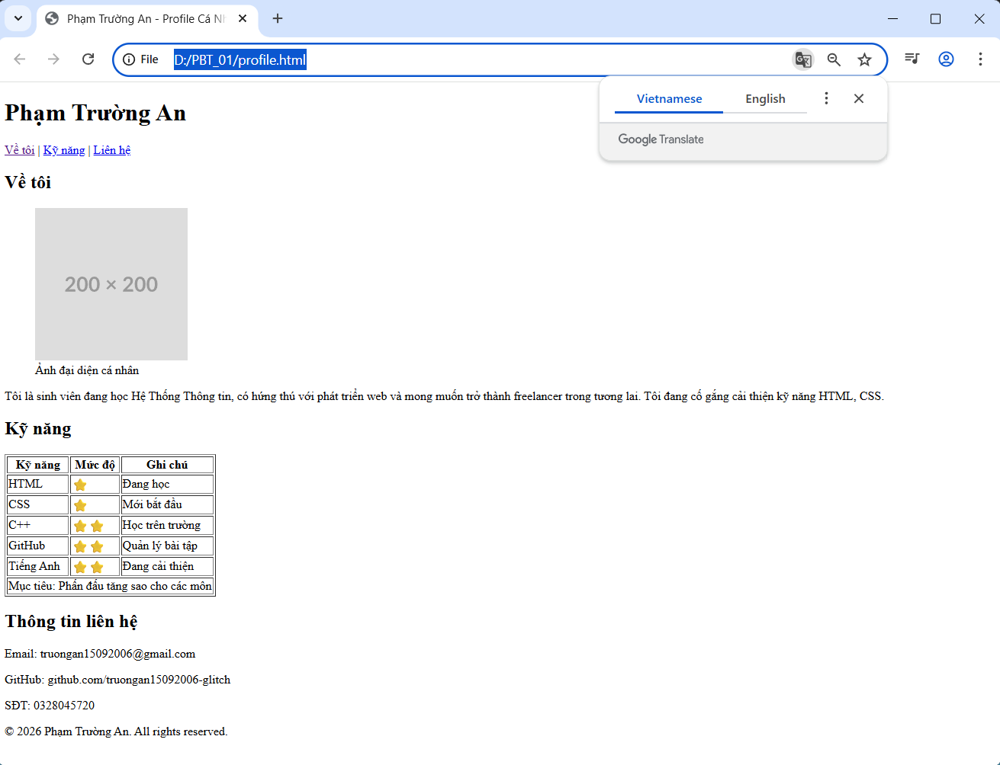
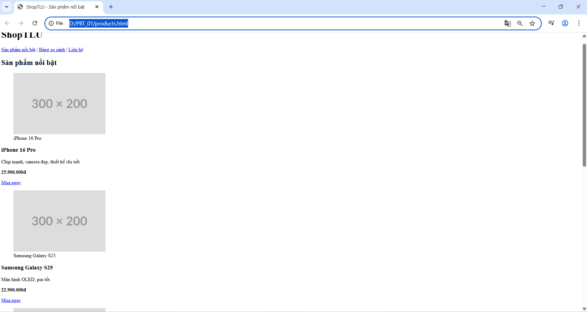
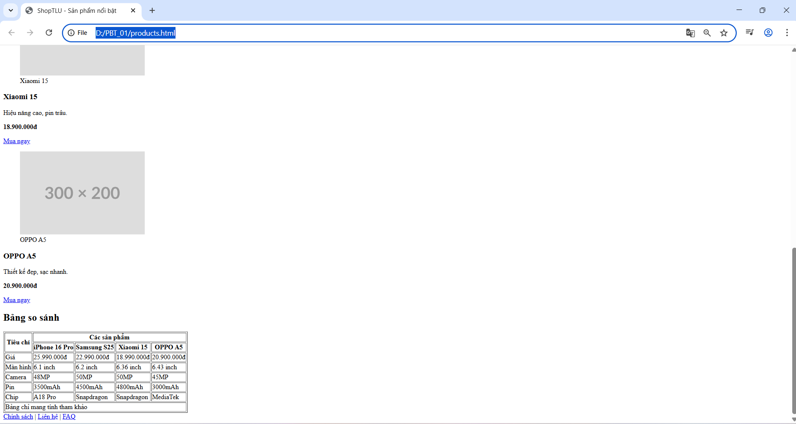
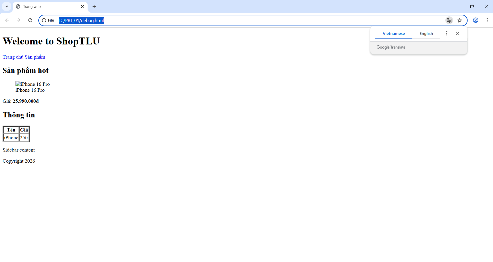
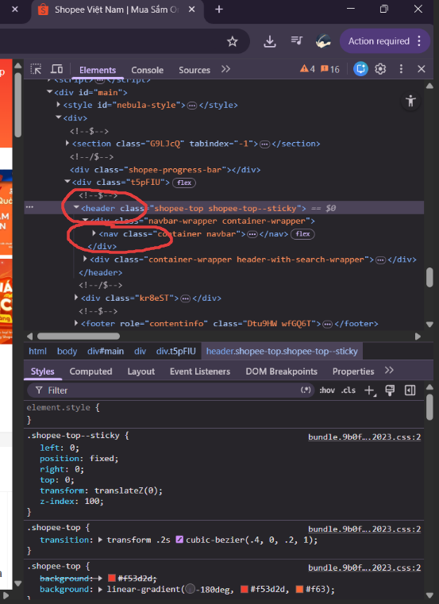
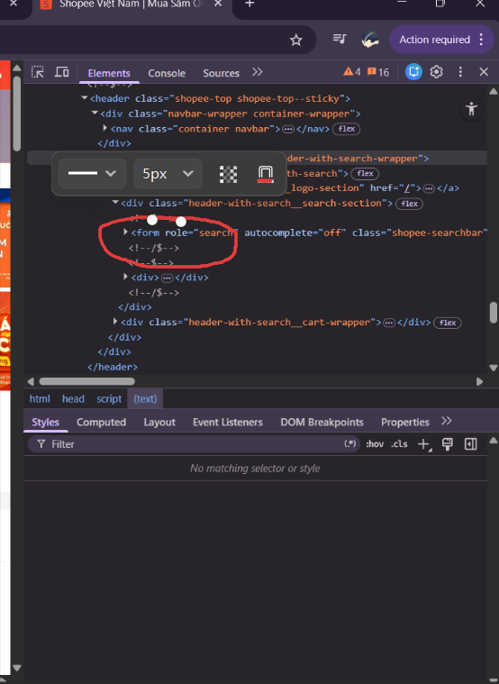
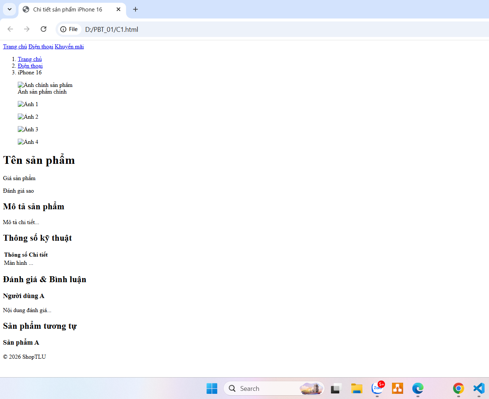

**Câu A1 (5đ) — HTTP & Browser**
Nguồn tham chiếu: 01_introduction_html_universe.md → HTTP Request Lifecycle
1. Quy trình khi nhập https://shopee.vn

Thứ tự quá trình duyệt:
1. DNS Lookup
Trình duyệt hỏi DNS server để chuyển shopee.vn → địa chỉ IP server.
2. TCP Connection
Trình duyệt tạo kết nối TCP với server qua cổng 443 (HTTPS).
3. TLS/SSL Handshake
Thiết lập mã hóa bảo mật HTTPS, xác thực chứng chỉ SSL.
4. HTTP Request
Browser gửi request:
GET / HTTP/1.1
Host: shopee.vn
5. Server Response
Server trả về HTML + CSS + JS + hình ảnh.
6. Browser Parsing
Browser parse HTML → DOM Tree, CSS → CSSOM.
7. Render Tree + Layout
Kết hợp DOM + CSSOM → Render Tree → tính toán vị trí.
8. Paint/Render
Hiển thị trang hoàn chỉnh lên màn hình.

Mục 2.1. Tab Network trong DevTools cho thấy thông tin:
- Request URL
- Status Code (200, 404, 500)
- Request Method (GET/POST)
- File Type (HTML/CSS/JS/Image)
- Size
- Load Time / Waterfall
- Tổng thời gian tải

Mục 2.2 Mở tab của https://shopee.vn
Ảnh Screenshot Tab Network:

1. Status Code của request đầu tiên: Status = 200
2. Tổng thời gian load trang: Finish = 15.37s
3. Một request trả về file CSS: Type Stylesheet

**Câu A2 (5đ) — Semantic HTML**
Nguồn tham chiếu: 04_semantic_html.md → Semantic HTML, SEO, Accessibility
- Vì Google đánh giá thấp vì cấu trúc HTML thiếu ngữ nghĩa (semantic), khiến search engine khó hiểu nội dung chính của trang.

- 4 lỗi Semantic:
Lỗi 1: Dùng 
 cho phần đầu trang thay vì <header>

Vấn đề: Google không biết đây là phần đầu trang.
Sửa lỗi: <header>

Lỗi 2: Menu điều hướng không dùng <nav>

Vấn đề: Bot không nhận diện đây là navigation menu.
Sửa lỗi: <nav>

Lỗi 3: Tên sản phẩm không dùng heading (<h1>, <h2>)

iPhone 16 Pro

Vấn đề: Google ưu tiên heading để hiểu chủ đề chính.
Sửa lỗi: <h1>iPhone 16 Pro</h1>

Lỗi 4: Sản phẩm không dùng <article>

Vấn đề: Google không biết đây là một nội dung/sản phẩm độc lập.
Sửa lỗi: <article>

Lỗi 5: Ảnh thiếu thuộc tính alt

Vấn đề: Google Image khó index
Sửa lỗi: 

**Câu A3 — Block vs Inline (5đ)**
Nguồn tham chiếu: 01_introduction_html_universe.md → Chương 02/03: Block vs Inline Elements
Vẽ bằng text art: kết quả hiển thị HTML
    Hộp 1
    Text A Text B
    Hộp 2
    Text C Text D
    Hộp 3
- Giải thích: Các thẻ 
 trong đoạn HTML trên là block-level elements nên mỗi thẻ sẽ chiếm toàn bộ chiều ngang của trang và tự động bắt đầu trên một dòng mới, vì vậy “Hộp 1”, “Hộp 2” và “Hộp 3” đều xuất hiện thành từng khối riêng biệt, tách nhau rõ ràng theo chiều dọc. 
+ Tiếp đó  và <strong> là inline elements nên chúng không chiếm toàn bộ chiều rộng mà chỉ sử dụng đúng phần không gian cần thiết cho nội dung bên trong. Vì vậy, “Text A” và “Text B” sẽ hiển thị liên tiếp trên cùng một dòng, tương tự “Text C” và “Text D” nếu còn đủ chỗ hiển thị.
+ <strong> còn mang ý nghĩa nhấn mạnh nội dung (thường in đậm), nhưng về cách bố trí dòng thì vẫn hoạt động như một phần tử inline giống . 

**Câu A4 (5đ) — Table**
Nguồn tham chiếu: 05_tables_hyperlinks.md → Table Structure (thead, tbody, tfoot)
Giải thích sự khác nhau giữa <thead>, <tbody>, <tfoot>:
+ <thead> là phần đầu của bảng, dùng để chứa hàng tiêu đề (header row), giúp xác định tên các cột như “Tên sản phẩm”, “Giá”, “Số lượng”, đồng thời hỗ trợ trình duyệt, SEO và screen reader hiểu cấu trúc bảng rõ hơn.
+ <tbody> là phần thân bảng, chứa toàn bộ dữ liệu chính của bảng, tức các hàng nội dung thực tế mà người dùng cần xem hoặc so sánh.
+ <tfoot> là phần cuối bảng, thường dùng cho tổng kết, ghi chú hoặc các thông tin như tổng tiền, trung bình, hoặc kết luận dữ liệu.

- Không nên dùng table để tạo layout toàn bộ trang web vì:

+ Table không mang ý nghĩa semantic cho bố cục trang, khiến Google và công cụ tìm kiếm khó hiểu cấu trúc nội dung chính.
+ Table làm giảm accessibility vì screen reader sẽ hiểu nhầm nội dung là dữ liệu dạng bảng thay vì giao diện bố cục.
+ Table khó responsive trên điện thoại và thiết bị nhỏ, vì cấu trúc hàng/cột cứng nhắc không linh hoạt như CSS Flexbox hoặc Grid.
+ Code layout bằng table thường dài, rối, khó bảo trì và chỉnh sửa hơn so với semantic HTML + CSS hiện đại.

**Bài B1 (15đ) — Trang Profile cá nhân**
Nguồn tham chiếu: `01_introduction_html_universe.md`, `04_semantic_html.md`, `05_tables_hyperlinks.md`

Ảnh Screenshot kết quả trên Chrome

**Bài B2 (15đ) — Trang Sản phẩm E-Commerce**
Nguồn tham chiếu: `04_semantic_html.md`, `05_tables_hyperlinks.md`

Ảnh Screenshot kết quả trên Chrome

**B3 Bài B3 (15đ) — Debug HTML
Nguồn tham chiếu: `01_introduction_html_universe.md` → HTML Syntax Basics, `04_semantic_html.md` → Semantic Structure Correction, `05_tables_hyperlinks.md` → Table Standards

Tìm lỗi file HTML:
Lỗi 1: Dòng 1 — `<!DOCTYPE>` sai chuẩn — Sửa thành `<!DOCTYPE html>`
Lỗi 2: Dòng 2 — Thiếu `lang="vi"` trong thẻ `<html>` — Thêm `lang="vi"`
Lỗi 3: Dòng 4 — Thẻ `<title>` không đóng — Thêm `</title>`
Lỗi 4: Dòng 5 — `utf8` sai chuẩn — Sửa thành `UTF-8`
Lỗi 5: Thiếu meta viewport — Thêm `<meta name="viewport" content="width=device-width, initial-scale=1.0">`
Lỗi 6: `<h1>` không đóng đúng — Sửa `</h1>`
Lỗi 7: Thẻ `<a>` đầu tiên không đóng — Thêm `</a>`
Lỗi 8: Link `href="home"` không rõ ràng — Sửa `home.html`
Lỗi 9: `` thiếu `alt` — Thêm mô tả ảnh
Lỗi 10: `<b>` và `
` lồng sai thứ tự — Dùng `<strong>` đúng semantic
Lỗi 11: Bảng thiếu `<thead>` và `<tbody>` — Bổ sung cấu trúc chuẩn
Lỗi 12: Dùng `<td>` cho header — Sửa thành `<th>`
Lỗi 13: Có 2 thẻ `<main>` — Đổi phần sidebar thành `<aside>`
Lỗi 14: Footer thiếu đóng `
` — Bổ sung đầy đủ

**Bài B4 (15đ) — Phân tích trang web thật**
Nguồn tham chiếu: `04_semantic_html.md` → Semantic HTML5 Structure (header, nav, form, section, article), `05_tables_hyperlinks.md` → Forms & Hyperlinks, Chrome DevTools (F12 → Elements)

**Phân tích trang web shopee.vn**
## 1. Semantic HTML:
- `<header>`: Khu vực phần đầu trang web 
(<header> nằm ở phần đầu trang Shopee (top bar), chứa logo, tìm kiếm, tài khoản và khu vực điều hướng chính, và nằm trong phần body.)
- `<nav>`: Thanh điều hướng danh mục
(<nav> nằm bên trong header, là thanh điều hướng chứa các liên kết chính, nằm trong phần body)
- `<form>`: Ô tìm kiếm sản phẩm

Hình Ảnh Src:

### Semantic chưa tối ưu:
- Một số khu vực dùng nhiều `
` thay vì `<section>`
- Một số card sản phẩm không dùng `<article>`

## 2. Table:
- Trang element shopee.vn không có table

## 3. Form:
- action: URL tìm kiếm
- method: GET
- input types: text, search, submit

Ảnh Src form: 

**Câu C1 (10đ) — Thiết kế cấu trúc**
Nguồn tham chiếu: `04_semantic_html.md` → Semantic Structure, `05_tables_hyperlinks.md` → Tables, Navigation & Links

<!DOCTYPE html>
<html lang="vi">
<head>
    <!-- head chứa metadata, title, charset -->
    <meta charset="UTF-8">
    <meta name="viewport" content="width=device-width, initial-scale=1.0">
    <title>Chi tiết sản phẩm iPhone 16</title>
</head>
<body>

    <header>
        <!-- header dùng cho phần đầu trang -->
        <nav>
            <!-- nav vì đây là khu vực điều hướng chính -->
            <a href="/">Trang chủ</a>
            <a href="/dien-thoai">Điện thoại</a>
            <a href="/khuyen-mai">Khuyến mãi</a>
        </nav>
    </header>

    <nav aria-label="breadcrumb">
        <!-- nav vì breadcrumb là điều hướng -->
        <ol>
            <!-- ol vì breadcrumb có thứ tự cấp bậc -->
            <li><a href="/">Trang chủ</a></li>
            <li><a href="/dien-thoai">Điện thoại</a></li>
            <li>iPhone 16</li>
        </ol>
    </nav>

    <main>
        <!-- main chứa nội dung chính duy nhất của trang -->

        <section>
            <!-- section nhóm khu vực ảnh sản phẩm -->
            <figure>
                <!-- figure chứa ảnh chính -->
                
                <figcaption>Ảnh sản phẩm chính</figcaption>
            </figure>

            <!-- gallery ảnh phụ -->
            <figure></figure>
            <figure></figure>
            <figure></figure>
            <figure></figure>
        </section>

        <article>
            <!-- article vì đây là nội dung sản phẩm độc lập -->
            <h1>Tên sản phẩm</h1>
            
Giá sản phẩm

            
Đánh giá sao

            <section>
                <!-- section cho mô tả -->
                <h2>Mô tả sản phẩm</h2>
                
Mô tả chi tiết...

            </section>
        </article>

        <section>
            <!-- section cho bảng thông số -->
            <h2>Thông số kỹ thuật</h2>
            <table>
                <!-- table vì dữ liệu dạng hàng/cột -->
                <thead>
                    <tr>
                        <th>Thông số</th>
                        <th>Chi tiết</th>
                    </tr>
                </thead>
                <tbody>
                    <tr>
                        <td>Màn hình</td>
                        <td>...</td>
                    </tr>
                </tbody>
            </table>
        </section>

        <section>
            <!-- section cho đánh giá người dùng -->
            <h2>Đánh giá & Bình luận</h2>
            <article>
                <!-- mỗi bình luận là nội dung độc lập -->
                <h3>Người dùng A</h3>
                
Nội dung đánh giá...

            </article>
        </section>

    </main>

    <aside>
        <!-- aside vì đây là nội dung phụ: sản phẩm tương tự -->
        <h2>Sản phẩm tương tự</h2>
        <article>
            <h3>Sản phẩm A</h3>
        </article>
    </aside>

    <footer>
        <!-- footer cho thông tin cuối trang -->
        
&copy; 2026 ShopTLU

    </footer>

</body>
</html>

Ảnh kết quả của trang:

**Câu C2 (10đ) — So sánh & Tranh luận

Việc dùng 
 cho mọi thành phần rồi chỉ thêm class có thể hoạt động về mặt hiển thị, nhưng về kỹ thuật đây không phải cách tối ưu. Semantic HTML giúp công cụ tìm kiếm như Google hiểu rõ cấu trúc nội dung, từ đó cải thiện SEO. Ví dụ, khi dùng <header>, <nav>, <main>, <article>, Google dễ xác định đâu là nội dung chính, đâu là điều hướng, giúp index trang hiệu quả hơn so với một loạt 
 vô nghĩa. Ngoài SEO, semantic HTML còn rất quan trọng với Accessibility. Các trình đọc màn hình (screen readers) cho người khiếm thị dựa vào semantic tags để điều hướng nhanh giữa các khu vực như menu, nội dung chính hoặc footer. Nếu mọi thứ đều là 
, trải nghiệm truy cập sẽ kém hơn đáng kể. Ví dụ thực tế: một trang tin tức dùng <article> cho mỗi bài viết sẽ giúp cả Google News lẫn screen reader nhận diện từng bài độc lập tốt hơn. Tuy nhiên, 
 vẫn hữu ích khi cần tạo container chung để bố cục CSS, chia layout hoặc nhóm các phần tử không mang ý nghĩa nội dung cụ thể. Nói ngắn gọn, semantic HTML không thay thế hoàn toàn 
, mà giúp lập trình viên xây dựng website chuẩn SEO, dễ bảo trì và thân thiện hơn với mọi người dùng.